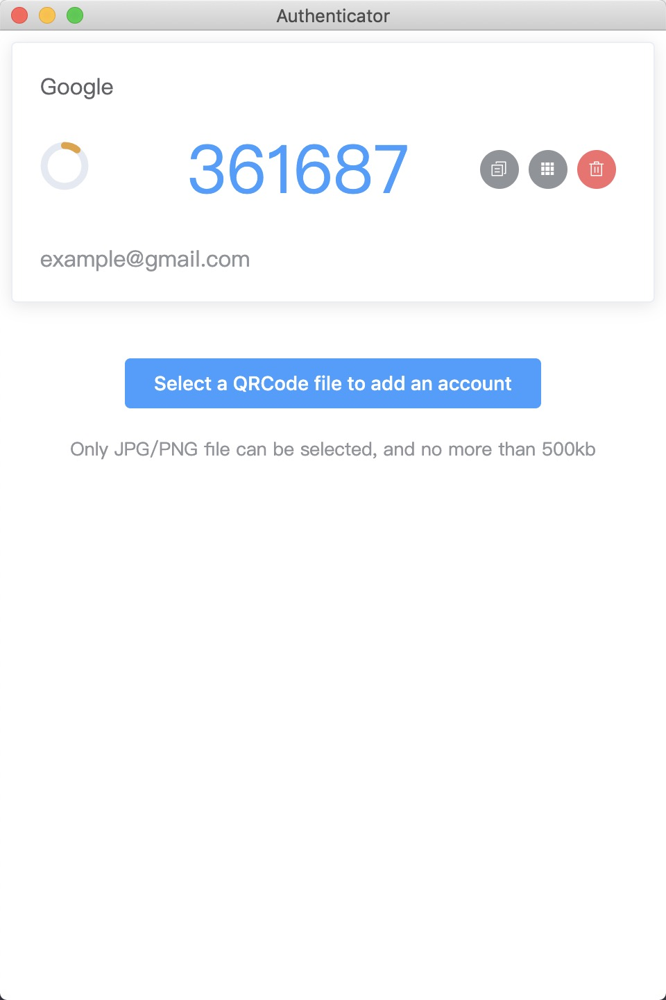

# Authenticator Desktop

> Two-factor authenticator(2FA) desktop client

## Setup

``` bash
# install dependencies
npm install

# serve with hot reload at localhost:9080
npm run dev

# build electron application for production
npm run build


# lint all JS/Vue component files in `src/`
npm run lint
```

### Framework & Library Setup
**Electron**: desktop runtime - [https://electronjs.org/](https://electronjs.org/)

**Electron-vue**: project - [https://github.com/SimulatedGREG/electron-vue](https://github.com/SimulatedGREG/electron-vue)

**Electron packager**: package -  [https://github.com/electron-userland/electron-packager](http://https://github.com/electron-userland/electron-packager)

``` bash
npm install electron-packager --save-dev
```

**Element UI**: UI Components -
[https://element.eleme.cn](https://element.eleme.cn)

``` bash
npm i element-ui -S

npm install babel-plugin-component -D
```

**Speakeasy**: TOTP/HOTP - [https://github.com/speakeasyjs/speakeasy](http://https://github.com/speakeasyjs/speakeasy)

``` bash
npm install --save speakeasy

npm install --save qrcode
```

**QRCode decoder**: QRCode decode - [https://github.com/yugasun/qrcode-decoder](http://https://github.com/yugasun/qrcode-decoder)

``` bash
npm install --save qrcode-decoder
```

**Clipboard**: clipboard - [https://github.com/zenorocha/clipboard.js/](http://https://github.com/zenorocha/clipboard.js/)

``` bash
npm install clipboard --save
```

## Package Desktop Client
``` bash
# build for macOS
npm run build:mas

# build for windows
npm run build:win32

# build for linux
npm run build:linux

# build for darwin
npm run build:darwin

# build clean
npm run build:clean
```

## Features
- Select a QRCode file to add an account
- Display a one-time passcode that calculates from a QRCode file
- Copy token to clipboard
- Delete an account
- Display a QR code picture about an account authentication URI

## Screenshot
**MacOS**



## License
MIT License

Copyright (c) 2017 Hcq

Permission is hereby granted, free of charge, to any person obtaining a copy of this software and associated documentation files (the "Software"), to deal in the Software without restriction, including without limitation the rights to use, copy, modify, merge, publish, distribute, sublicense, and/or sell copies of the Software, and to permit persons to whom the Software is furnished to do so, subject to the following conditions:

The above copyright notice and this permission notice shall be included in all copies or substantial portions of the Software.

THE SOFTWARE IS PROVIDED "AS IS", WITHOUT WARRANTY OF ANY KIND, EXPRESS OR IMPLIED, INCLUDING BUT NOT LIMITED TO THE WARRANTIES OF MERCHANTABILITY, FITNESS FOR A PARTICULAR PURPOSE AND NONINFRINGEMENT. IN NO EVENT SHALL THE AUTHORS OR COPYRIGHT HOLDERS BE LIABLE FOR ANY CLAIM, DAMAGES OR OTHER LIABILITY, WHETHER IN AN ACTION OF CONTRACT, TORT OR OTHERWISE, ARISING FROM, OUT OF OR IN CONNECTION WITH THE SOFTWARE OR THE USE OR OTHER DEALINGS IN THE SOFTWARE.


